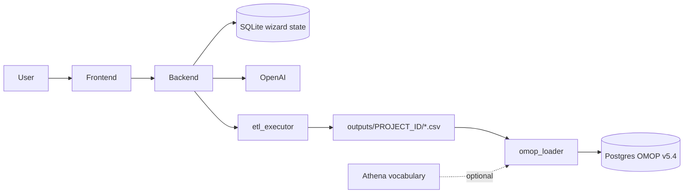

# OMOP ETL Auto-Designer

A code-less, browser-based ETL builder that converts any flat source CSV into an
OMOP CDM v5.4 compliant database. Users define all transformation logic through
a 12-step wizard UI; OpenAI generates the per-table Python transformations; a
bundled Postgres container with the full OMOP CDM v5.4 schema receives the
loaded data.

---

## Architecture



```
ETL_auto_designer/
├── backend/                FastAPI + SQLite (wizard state)
│   ├── app/
│   │   ├── api/            REST routes
│   │   ├── services/       etl_executor, omop_loader, vocab_loader, code_generator
│   │   ├── prompts/        Per-table prompt templates for OpenAI
│   │   └── ...
│   ├── omop_ddl/           OHDSI CDM v5.4 DDL + PKs (applied by omop-init)
│   ├── uploads/            Uploaded source CSVs / mapping CSVs
│   ├── outputs/            Generated OMOP CSVs per project
│   ├── Dockerfile
│   └── requirements.txt
│
├── frontend/               React + Vite + TailwindCSS (12-step wizard)
│   ├── src/
│   │   ├── pages/wizard/   Step1_Upload … Step12_LoadDB
│   │   ├── components/     Shared UI (ConceptSearch, ErrorBanner, …)
│   │   ├── hooks/          useTableConfig
│   │   ├── api/client.ts   Axios client
│   │   └── types/
│   └── Dockerfile
│
├── scripts/init-omop.sh    Substitutes @cdmDatabaseSchema → $OMOP_SCHEMA and applies DDL/PKs
├── docker-compose.yml      Postgres + omop-init + backend + frontend
└── .env.example            Stack-wide environment variables
```

---

## Quick start (Docker — recommended)

```powershell
# 1. Copy and edit env file (set OPENAI_API_KEY)
copy .env.example .env

# 2. Bring the whole stack up
docker compose up --build
```

Services:

| Service     | URL                       | Notes                                        |
|-------------|---------------------------|----------------------------------------------|
| Frontend    | http://localhost:5173     | Vite dev server                              |
| Backend     | http://localhost:8000     | FastAPI + Swagger at `/docs`                 |
| Postgres    | localhost:5432            | `psql -U omop -d omop`                       |
| `omop-init` | one-shot                  | Applies OMOP v5.4 DDL + PKs into `${OMOP_SCHEMA}` on first start (idempotent) |

The OMOP DDL placeholder `@cdmDatabaseSchema` is substituted with `${OMOP_SCHEMA}` (default `cdm`) before being piped into `psql`.

---

## Quick start (local Python / Node)

```powershell
# Backend
cd backend
copy .env.example .env       # set OPENAI_API_KEY
pip install -r requirements.txt
python -m uvicorn app.main:app --reload --port 8000

# Frontend
cd frontend
npm install
npm run dev
```

The DB-load step (Step 12) is only fully functional when Postgres is reachable; you can still run Steps 1–11 without it.

---

## Environment variables

Set in repo-root `.env` (consumed by `docker-compose.yml`) and/or `backend/.env`:

| Variable                | Default                                | Purpose                                                       |
|-------------------------|----------------------------------------|---------------------------------------------------------------|
| `OPENAI_API_KEY`        | *(required for codegen / chat)*        | OpenAI API key                                                |
| `OPENAI_MODEL`          | `gpt-4o`                               | Model used for code generation and the chat assistant         |
| `ENTITYLINKER_URL`      | `http://localhost:8000/api/conceptlink`| Optional concept-search service                               |
| `DATABASE_URL`          | `sqlite:///./etl_designer.db`          | Wizard state DB (kept on SQLite for simplicity)               |
| `POSTGRES_USER`         | `omop`                                 | OMOP Postgres user                                            |
| `POSTGRES_PASSWORD`     | `omop`                                 | OMOP Postgres password                                        |
| `POSTGRES_DB`           | `omop`                                 | OMOP Postgres database                                        |
| `OMOP_DB_HOST`          | `postgres`                             | Backend uses this to reach Postgres (set to `localhost` outside Docker) |
| `OMOP_DB_PORT`          | `5432`                                 |                                                               |
| `OMOP_SCHEMA`           | `cdm`                                  | Target schema for the OMOP CDM tables                         |
| `ATHENA_BUNDLE_ROOT`    | *(empty)*                              | Allow-list root for `/load-vocabulary` (security guard)       |
| `MAPPINGS_BUNDLE_ROOT`  | *(empty → uploads dir)*                | Allow-list root for `/load-mappings-from-dir`                 |

---

## Wizard walkthrough

| Step | Page                       | Purpose                                                                                                                          |
|------|----------------------------|----------------------------------------------------------------------------------------------------------------------------------|
| 1    | Source upload              | Drop in your flat CSV — delimiter, encoding and columns are auto-detected.                                                       |
| 2    | Location                   | Map address columns (city, state, county/country) for both person and care site, with separate country-concept mappings.         |
| 3    | Care Site                  | Configure care_site name + place_of_service. Warns if Step 2 has no `cs_*` columns mapped (care_site would be empty otherwise).  |
| 4    | Provider                   | Provider source value, gender default, specialty mapping (prefix or value-map). Help text clarifies precedence.                  |
| 5    | Person                     | Person ID, gender, DOB strategy (full date vs year-only), race/ethnicity. Shows the FK columns inherited from earlier steps.     |
| 6    | Visit                      | Define multiple visit timepoints. Each gets a stable internal id; `visit_source_value` is auto-computed as `{person}|{label}`.   |
| 7    | Observation period         | Start date is required; period-type uses a dropdown of standard OMOP concepts.                                                   |
| 8    | Death                      | Optional. Inline help clarifies filter semantics (empty filter → all rows treated as deceased).                                  |
| 9    | Concept mapping            | Per-column decision: map-with-AI, use defaults, or skip. Shared `ConceptSearch` picker. Gate-on-progress before next.            |
| 10   | Stem table                 | Variable groups derived from the visit labels of Step 6. Structural FK columns hidden from the picker. Overrides have stable ids.|
| 11   | Generate & Execute         | `Generate all` or per-table generate. Execution runs each script as its own subprocess in dependency order with per-table logs.  |
| 12   | Load to OMOP DB            | Connect to Postgres, pick shared or project-scoped schema, optionally load Athena vocabulary, bulk-COPY all output CSVs.         |

---

## Execution model

`etl_executor.execute_etl_scripts` runs **one Python subprocess per generated table**, in the dependency order
`location → care_site → provider → person → visit_occurrence → observation_period → stem_table → death`,
sharing `ETL_OUTPUT_DIR` so each script can read its predecessors' output. The per-table status, log
fragment, row count and elapsed time are returned to the UI and surfaced on Step 11.

---

## OMOP CDM v5.4 DDL

`backend/omop_ddl/` ships with the OHDSI Postgres DDL + primary keys vendored from
[CommonDataModel v5.4](https://github.com/OHDSI/CommonDataModel/tree/v5.4/inst/ddl/5.4/postgresql).
The `omop-init` compose service applies these on first start and writes a marker row so
subsequent boots are a no-op. Indices and FK constraints are intentionally **not** applied
by default — they can be applied manually after ETL + vocabulary load using the same
`sed | psql` invocation shown in `backend/omop_ddl/OMOPCDM_postgresql_5.4_indices.sql`.

---

## Loading OMOP outputs into Postgres (Step 12)

- Pick a schema mode: **shared** (`cdm`) or **project-scoped** (`cdm_<project_id>`).
- `omop_loader.py` opens each CSV under `outputs/<project_id>/`, intersects its columns with the
  target table's columns from `information_schema.columns`, and bulk-loads the intersection
  with `COPY ... WITH (FORMAT csv, DELIMITER ';', NULL '', QUOTE '"')`.
- Optional pre-load `TRUNCATE ... CASCADE`. Per-table row counts and elapsed time are streamed to the UI.
- The UI polls `/api/projects/<id>/load-status` every 1.5s.

---

## Loading Athena vocabularies (optional)

`vocab_loader.py` accepts a directory of Athena-exported tab-delimited CSVs and bulk-loads each one
into the configured schema, truncating first for idempotency. The bundle path must lie inside
`$ATHENA_BUNDLE_ROOT`. With the bundled Docker stack, mount your unzipped Athena bundle on
`/vocab` inside the backend container and point Step 12 at `/vocab`.

---

## API reference (selected)

| Method | Endpoint                                          | Description                                               |
|--------|---------------------------------------------------|-----------------------------------------------------------|
| POST   | `/api/projects/`                                  | Create a project                                          |
| POST   | `/api/projects/{id}/upload-source`                | Upload + auto-detect source CSV                           |
| POST   | `/api/projects/{id}/upload-mapping`               | Upload one concept-mapping CSV                            |
| POST   | `/api/projects/{id}/load-mappings-from-dir`       | Bulk load mapping CSVs from a directory (allow-listed)    |
| PATCH  | `/api/projects/{id}/config`                       | Save a wizard step's config                               |
| POST   | `/api/projects/{id}/generate`                     | Generate ETL scripts (all tables)                         |
| POST   | `/api/projects/{id}/generate/{table}`             | Generate one table                                        |
| POST   | `/api/projects/{id}/execute`                      | Execute the generated ETL                                 |
| GET    | `/api/projects/{id}/execution-log`                | Last execution status                                     |
| POST   | `/api/projects/{id}/load-database`                | Bulk-load output CSVs into Postgres                       |
| GET    | `/api/projects/{id}/load-status`                  | Live load progress                                        |
| POST   | `/api/load-vocabulary`                            | Load an Athena bundle into Postgres                       |
| GET    | `/api/db-health`                                  | Postgres reachability + DDL-applied check                 |
| POST   | `/api/projects/{id}/chat`                         | AI assistant for a specific table's generated code        |

---

## Smoke test

Run an end-to-end check against the bundled test source:

```powershell
./scripts/smoke.ps1
```

The script creates a project, uploads `test_data/test_source.csv`, generates scripts,
executes them, and prints the resulting output file list and per-table row counts.
