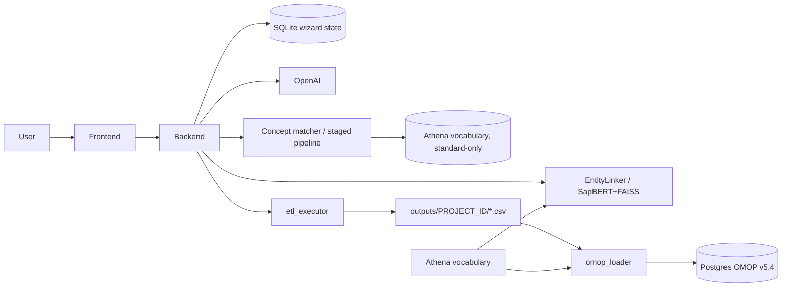

# OMOP ETL Auto-Designer

A code-less, browser-based ETL builder that converts any flat source CSV into an
OMOP CDM v5.4 compliant database. Users define all transformation logic through
a wizard UI (7 required steps + up to 4 optional OMOP table steps); OpenAI
generates the per-table Python transformations; a bundled Postgres container
with the full OMOP CDM v5.4 schema receives the loaded data.

---

## Architecture



```
ETL_auto_designer/
├── backend/                FastAPI + SQLite (wizard state)
│   ├── app/
│   │   ├── api/            REST routes
│   │   ├── services/       etl_executor, omop_loader, vocab_loader, code_generator
│   │   ├── prompts/        Per-table prompt templates for OpenAI
│   │   └── ...
│   ├── omop_ddl/           OHDSI CDM v5.4 DDL + PKs (applied by omop-init)
│   ├── uploads/            Uploaded source CSVs / mapping CSVs
│   ├── outputs/            Generated OMOP CSVs per project
│   ├── Dockerfile
│   └── requirements.txt
│
├── frontend/               React + Vite + TailwindCSS (slug-based wizard)
│   ├── src/
│   │   ├── pages/wizard/   SourceStep … FinalizeStep
│   │   ├── components/     Shared UI (ConceptSearch, ErrorBanner, …)
│   │   ├── hooks/          useTableConfig
│   │   ├── api/client.ts   Axios client
│   │   └── types/
│   └── Dockerfile
│
├── entitylinker/           SapBERT + FAISS concept-search service
│   ├── entitylinker/       Python library (ConceptLinker, Reranker, config loader)
│   ├── api/                FastAPI app exposing POST /api/conceptlink
│   ├── config.container.yaml  data_dir + vocabularies for the container
│   ├── dockerfile
│   └── requirements.txt
│
├── scripts/init-omop.sh    Calls python -m app.services.ddl_applier bootstrap to split vocab/clinical DDL into separate schemas
├── docker-compose.yml      Postgres + omop-init + entitylinker + conceptmatcher + backend + frontend
└── .env.example            Stack-wide environment variables

../new concept finding/     Sibling checkout — the staged concept matcher (see below).
                            Built here as the `conceptmatcher` service; not vendored in.
```

---

## Quick start (Docker — recommended)

```powershell
# 1. Copy and edit env file (set OPENAI_API_KEY)
copy .env.example .env

# 2. Bring the whole stack up
docker compose up --build
```

Services:

| Service        | URL                       | Notes                                        |
|----------------|---------------------------|----------------------------------------------|
| Frontend       | http://localhost:5173     | Vite dev server                              |
| Backend        | http://localhost:8000     | FastAPI + Swagger at `/docs`                 |
| EntityLinker   | http://localhost:8001     | SapBERT + FAISS concept search. Swagger at `/docs`. Internal URL `http://entitylinker:8000/api/conceptlink`. |
| Postgres       | localhost:5432            | `psql -U omop -d omop`                       |
| `omop-init`    | one-shot                  | Splits the OMOP v5.4 DDL into vocabulary and clinical buckets and applies each into its own schema (`${OMOP_VOCAB_SCHEMA}` and `${OMOP_SCHEMA}`). Idempotent via per-schema marker rows. |

The DDL splitting and application is owned by `backend/app/services/ddl_applier.py`. The `omop-init` service is a thin shell wrapper that waits for Postgres and invokes `python -m app.services.ddl_applier bootstrap`. Clinical sessions run with `search_path = <clinical>, vocab, public` so unqualified `concept` lookups resolve.

---

## Quick start (local Python / Node)

```powershell
# Backend
cd backend
copy .env.example .env       # set OPENAI_API_KEY
pip install -r requirements.txt
python -m uvicorn app.main:app --reload --port 8000

# Frontend
cd frontend
npm install
npm run dev
```

The DB-load card in the Finalize step is only fully functional when Postgres is reachable; you can still configure and generate all scripts without it.

---

## Environment variables

Set in repo-root `.env` (consumed by `docker-compose.yml`) and/or `backend/.env`:

| Variable                | Default                                | Purpose                                                       |
|-------------------------|----------------------------------------|---------------------------------------------------------------|
| `OPENAI_API_KEY`        | *(required for codegen / chat)*        | OpenAI API key                                                |
| `OPENAI_MODEL`          | `gpt-4o`                               | Model used for code generation and the chat assistant         |
| `ENTITYLINKER_URL`      | (inside Docker: `http://entitylinker:8000/api/conceptlink`) | SapBERT+FAISS concept-search service. Started automatically by the compose stack. |
| `DATABASE_URL`          | `sqlite:///./etl_designer.db`          | Wizard state DB (kept on SQLite for simplicity)               |
| `POSTGRES_USER`         | `omop`                                 | OMOP Postgres user                                            |
| `POSTGRES_PASSWORD`     | `omop`                                 | OMOP Postgres password                                        |
| `POSTGRES_DB`           | `omop`                                 | OMOP Postgres database                                        |
| `OMOP_DB_HOST`          | `postgres`                             | Backend uses this to reach Postgres (set to `localhost` outside Docker) |
| `OMOP_DB_PORT`          | `5432`                                 |                                                               |
| `OMOP_SCHEMA`           | `cdm`                                  | Target schema for the clinical CDM tables                     |
| `OMOP_VOCAB_SCHEMA`     | `vocab`                                | Target schema for the shared vocabulary tables                |
| `ATHENA_BUNDLE_ROOT`    | *(empty)*                              | Allow-list root for `/load-vocabulary` (security guard)       |
| `MAPPINGS_BUNDLE_ROOT`  | *(empty → uploads dir)*                | Allow-list root for `/load-mappings-from-dir`                 |
| `CONCEPT_MATCHER_URL`   | (inside Docker: `http://conceptmatcher:8000`) | Bulk concept matcher behind the Concepts step's "Load concepts" button. Empty disables the button. |
| `CONCEPT_PIPELINE_PATH` | `../new concept finding`               | Docker build context for that service — the sibling checkout  |
| `VOCAB_DB_HOST` / `VOCAB_DB_PORT` | `host.docker.internal` / `5433` | Where the matcher finds the standard-only Athena vocabulary   |

---

## Automatic concept matching (Concepts step → "Load concepts")

The Concepts step has two, quite different, concept finders:

| | **AI Search** (per row) | **Load concepts** (whole project) |
|---|---|---|
| service | `entitylinker` — SapBERT + FAISS | `conceptmatcher` — the staged pipeline in `../new concept finding` |
| answers | "what concepts look like this phrase?" — a ranked list you pick from | "what is this column?" — one concept per column, plus a decision |
| you get | candidates + optional GPT justification | `auto_accept` / `review` / `unmapped` per column, with a confidence |
| vocabulary | the Athena bundle at `ATHENA_BUNDLE_PATH` | that project's own Postgres: **standard + valid concepts only** |

### Give it descriptions first

The matcher's accuracy hinges on what it is given. A column *name* is an
identifier — `DOC_PAT_HAIR`, `creat_mgdl` — while a description is prose a
vocabulary can actually be searched with, and the pipeline searches both. Same
project, `city` as the only input versus `city` + "City of residence": the
second is an exact hit on concept 4335813 at confidence 100; the first is a
guess.

So the **Descriptions** button next to *Load concepts* opens the project's data
dictionary:

- **Download template** — a CSV of every source column (`name,table,description`),
  pre-filled with whatever is already stored, so it doubles as an export.
- **Upload CSV / Excel** — merges a dictionary in (tick *Replace* to start over).
  Bring whatever you already have: `.csv`, `.tsv` or `.xlsx`; delimiter and
  encoding are sniffed; the header row can say `name`/`column`/`variable`/`field`
  and `description`/`definition`/`label`/`meaning`; column names match regardless
  of case, spaces or underscores; other columns are ignored. Rows naming a column
  the project doesn't have are reported back, not dropped silently.
- Each row also has an editable **Description** field, for fixing one entry
  without another round-trip through a spreadsheet.

Descriptions live on the project (`projects.column_descriptions`) and the backend
attaches them to every match request, so they apply no matter where the match is
triggered from.

### Running it

Every variable starts on **Map variable**, so one click on **Load concepts**
maps the whole project. It sends every included, still-unmapped column — across
*all* source files, not just the selected one. A variable that already has a
concept is never overwritten.

What happens to each answer depends on how sure the pipeline was:

| its verdict | what the step does |
|---|---|
| **auto-accept** (≥ 90) | sets the concept, with a green confidence chip on the row |
| **review** (70–90) | **sets nothing.** The row offers the 5 ranked candidates, best first and marked *Best match*, for you to click |
| **unmapped** (< 70) | leaves the row untouched |

The review case is the one that matters. A serum-creatinine column, for
instance, comes back at 82 with *Creatinine in peritoneal fluid/Creatinine in
serum* on top — while the concept you actually want, *Creatinine [Mass/volume]
in Serum or Plasma*, is fourth on the same shortlist, 2.7 points behind.
Writing the leader would have been quietly wrong; showing all five and letting
you pick takes one click and is right.

Rows awaiting a choice are badged while collapsed and have their own **Review**
filter in the toolbar, and the shortlists are saved with the rest of the step,
so a run survives a reload. The panel at the top lists, by name, what needs a
look and what came back unmapped.

### Bringing the matcher up

It needs the sibling project's **own** database — the standard-only Athena
vocabulary plus its `pipeline` schema, roughly 9GB — which is a separate stack
on host port 5433. That stack is not duplicated here; the container reaches the
running one through the host gateway, so the two stay independently startable.

```bash
cd "../new concept finding"
./load_vocab.sh          # the vocabulary (10-20 min, once)
./setup_pipeline.sh      # the pipeline's database objects (~2 min, once)

cd -                     # back here
docker compose up -d conceptmatcher
curl localhost:8002/health
```

The service is `pipeline/service.py` in that project, run as `serve`. The
`conceptmatcher` compose service and that project's own `pipeline` service share
one image tag (`vocab-pipeline:latest`), so whichever stack builds it first, the
other reuses it rather than building ~2GB of CPU torch twice.

Without all that, the button is disabled and says why — the step works exactly
as before, by hand.

### Keeping it current

That project's `pipeline/` and `data/` are bind-mounted read-only over the
image's own copies, the same way its own compose does it, so a changed
threshold, stopword list or scoring stage does **not** need a rebuild. What it
does need is a restart, because unlike the CLI — one-shot, so it re-reads
everything on each invocation — this is a long-running process that imported the
code once at startup:

```bash
docker compose restart conceptmatcher     # after editing the pipeline
docker compose build conceptmatcher       # only for requirements.txt changes
```

A stale matcher is otherwise invisible: it keeps answering, just with the old
ranking. `docker exec omop-conceptmatcher md5sum /app/pipeline/config.py`
against the host file settles it.

---

## Wizard walkthrough

Steps 2–4 and Death are optional (toggled from the Source step's table picker). All others are required.

| Step (slug)       | Page                       | Purpose                                                                                                                          |
|-------------------|----------------------------|----------------------------------------------------------------------------------------------------------------------------------|
| `source`          | Source upload              | Drop in your flat CSV — delimiter, encoding and columns are auto-detected. Toggle optional OMOP tables here.                     |
| `location` *      | Location                   | Map address columns (city, state, county/country) for both person and care site, with separate country-concept mappings.         |
| `care-site` *     | Care Site                  | Configure care_site name + place_of_service. Warns if Location has no `cs_*` columns mapped.                                    |
| `provider` *      | Provider                   | Provider source value, gender default, specialty mapping (prefix or value-map). Help text clarifies precedence.                  |
| `person`          | Person                     | Person ID, gender, DOB strategy (full date vs year-only), race/ethnicity. Shows the FK columns inherited from earlier steps.     |
| `visit`           | Visit                      | Define multiple visit timepoints. Each gets a stable internal id; `visit_source_value` is auto-computed as `{person}|{label}`.   |
| `obs-period`      | Observation period         | Start date is required; period-type uses a dropdown of standard OMOP concepts.                                                   |
| `death` *         | Death                      | Inline help clarifies filter semantics (empty filter → all rows treated as deceased).                                            |
| `concepts`        | Concept mapping            | Per-column decision, defaulting to **Map variable**. Upload a data dictionary under **Descriptions**, then **Load concepts** maps every variable at once through the staged matcher (see above); AI Search and manual entry handle the rest. Gate-on-progress before next. |
| `stem-table`      | Stem table                 | Variable groups derived from the visit labels defined in the Visit step. Structural FK columns hidden from the picker.           |
| `finalize`        | Generate + Load            | Generate all scripts (or per-table), execute them in dependency order with per-table logs, then load results into Postgres. Two cards: **Card 1** bulk-loads the Athena vocab bundle; **Card 2** bulk-COPYs the project's output CSVs and optionally applies indices + FK constraints. |

\* optional — only shown when enabled from the Source step.

---

## Execution model

`etl_executor.execute_etl_scripts` runs **one Python subprocess per generated table**, in the dependency order
`location → care_site → provider → person → visit_occurrence → observation_period → stem_table → death`,
sharing `ETL_OUTPUT_DIR` so each script can read its predecessors' output. The per-table status, log
fragment, row count and elapsed time are returned to the UI and surfaced on the Finalize step.

---

## OMOP CDM v5.4 DDL

`backend/omop_ddl/` ships with the OHDSI Postgres DDL + primary keys vendored from
[CommonDataModel v5.4](https://github.com/OHDSI/CommonDataModel/tree/v5.4/inst/ddl/5.4/postgresql).
The vendored DDL file intermingles vocab and clinical `CREATE TABLE` statements;
[`backend/app/services/ddl_applier.py`](backend/app/services/ddl_applier.py) parses it at import
time, buckets statements by table name (`VOCAB_TABLES` list), and applies each bucket into a
separate schema:

- Vocabulary tables (concept, vocabulary, …) → `${OMOP_VOCAB_SCHEMA}` (default `vocab`)
- Clinical tables (person, visit_occurrence, …) → `${OMOP_SCHEMA}` (default `cdm`) or a
  project-scoped schema picked in the Finalize step.

Per-schema `__ddl_marker` rows make application idempotent. Indices and FK constraints are
**not** applied by `omop-init`; they're triggered from the Finalize step when the user ticks
"Apply indices and FK constraints after load".

---

## Loading OMOP outputs into Postgres (Finalize step)

The Finalize step is split into two cards.

**Card 1 — Vocabulary** calls `POST /api/load-vocabulary` after auto-detecting an Athena
bundle at `/vocab` (overridable via free-text). The backend ensures the `vocab` schema and
its DDL exist, then `vocab_loader.py` truncates and bulk-loads each `<TABLE>.csv` with
`COPY ... WITH (FORMAT csv, DELIMITER E'\t', HEADER, QUOTE E'\b')`. Per-file progress is
polled via `GET /api/vocab-status`.

**Card 2 — ETL** calls `POST /api/projects/<id>/load-database` with the chosen
`schema_mode`, optional `schema_name`, `truncate`, and `apply_indices` flag. The backend
ensures the clinical schema and DDL exist (idempotent), sets `search_path = <clinical>, vocab, public`
on the load connection, then `omop_loader.py` walks each generated CSV, intersects its
columns with the target table's columns from `information_schema.columns`, and bulk-loads
the intersection with `COPY ... WITH (FORMAT csv, DELIMITER ';', NULL '', QUOTE '"')`. When
`apply_indices` is true, two synthetic table rows (`__indices__`, `__constraints__`) appear
in the per-table progress and are filled by `ddl_applier.apply_indices` / `apply_constraints`
after the CSV load. Per-table status is polled via `GET /api/projects/<id>/load-status`.

Both polls run at 1.5 s.

---

## Vocabulary files — single source of truth

You only manage **one** directory on the host. Point `ATHENA_BUNDLE_PATH` (in `.env`) at the
folder containing your unzipped Athena export, and three different components pick what they
need from it:

| Component | Files read | Mounted at | Mode |
|---|---|---|---|
| Finalize / Card 1 — vocab loader | CONCEPT.csv, VOCABULARY.csv, DOMAIN.csv, CONCEPT_CLASS.csv, RELATIONSHIP.csv, CONCEPT_RELATIONSHIP.csv, CONCEPT_SYNONYM.csv, CONCEPT_ANCESTOR.csv, DRUG_STRENGTH.csv (all tab-delimited) | `/vocab` on `backend` | read-only |
| Finalize / Card 2 — ETL loader | (your project's generated CSVs in `outputs/<project_id>/`) | `/app/outputs` on `backend` | read-write |
| Concepts step — EntityLinker concept search | CONCEPT.csv (tab-delimited) only | `/data` on `entitylinker` | read-write* |

*EntityLinker uses the same directory to cache its FAISS index and SapBERT embeddings
(`embeddings_*.npy`, `lookup_*.csv`, `faiss_*.index`). These files are auto-created on first
run (a few minutes for SNOMED+LOINC; longer for full RxNorm). `.gitignore` already excludes
them.

**Concretely**: drop your unzipped Athena bundle anywhere on the host, set
`ATHENA_BUNDLE_PATH=/your/absolute/path` in `.env`, then `docker compose up --build`.
Card 1 of the Finalize step auto-detects the bundle and shows "Detected 9 vocabulary files"; the
EntityLinker container starts building its FAISS index on first request.

If you don't want to bundle EntityLinker's caches with the same dir, mount them separately
by editing `docker-compose.yml` — change the `entitylinker` service's
`${ATHENA_BUNDLE_PATH:-./vocab_bundle}:/data` to a dedicated cache volume and copy
`CONCEPT.csv` into it.

## Upgrading from a pre-vocab-schema dev DB

Earlier versions stored vocabulary tables in the same schema as clinical data (`cdm`). To
upgrade, the simplest path is to drop the Postgres volume:

```powershell
docker compose down -v   # removes pgdata
docker compose up --build
```

`omop-init` will create both `vocab` and `cdm` cleanly. If you want to preserve any other
schemas in the database, run instead:

```powershell
docker compose exec postgres psql -U omop -d omop -c "DROP SCHEMA cdm CASCADE; DROP SCHEMA IF EXISTS vocab CASCADE;"
docker compose restart omop-init
```

Per-project `cdm_<id>` schemas are unaffected.

---

## API reference (selected)

| Method | Endpoint                                          | Description                                               |
|--------|---------------------------------------------------|-----------------------------------------------------------|
| POST   | `/api/projects/`                                  | Create a project                                          |
| POST   | `/api/projects/{id}/upload-source`                | Upload + auto-detect source CSV                           |
| POST   | `/api/projects/{id}/upload-mapping`               | Upload one concept-mapping CSV                            |
| POST   | `/api/projects/{id}/load-mappings-from-dir`       | Bulk load mapping CSVs from a directory (allow-listed)    |
| PATCH  | `/api/projects/{id}/config`                       | Save a wizard step's config                               |
| POST   | `/api/projects/{id}/generate`                     | Generate ETL scripts (all tables)                         |
| POST   | `/api/projects/{id}/generate/{table}`             | Generate one table                                        |
| POST   | `/api/projects/{id}/execute`                      | Execute the generated ETL                                 |
| GET    | `/api/projects/{id}/execution-log`                | Last execution status                                     |
| POST   | `/api/projects/{id}/load-database`                | Bulk-load output CSVs into Postgres (accepts `apply_indices: bool`) |
| GET    | `/api/projects/{id}/load-status`                  | Live ETL load progress                                    |
| POST   | `/api/load-vocabulary`                            | Load an Athena bundle into the configured vocab schema    |
| GET    | `/api/vocab-status`                               | Live vocabulary load progress                             |
| GET    | `/api/vocab-bundle-info?path=/vocab`              | Auto-detect vocab CSVs at a path (path must lie inside `ATHENA_BUNDLE_ROOT`) |
| GET    | `/api/db-health`                                  | Postgres reachability + per-schema DDL + vocab row count  |
| POST   | `/api/projects/{id}/chat`                         | AI assistant for a specific table's generated code        |
| GET    | `/api/projects/concept-matcher/health`            | Is the bulk concept matcher up, and what has it loaded    |
| POST   | `/api/projects/{id}/match-concepts`               | Map a column list onto standard OMOP concepts in one pass |
| GET/PUT| `/api/projects/{id}/column-descriptions`          | Read / replace the project's data dictionary              |
| POST   | `/api/projects/{id}/column-descriptions/upload`   | Merge in a CSV/Excel dictionary (`?replace=true` to overwrite) |
| GET    | `/api/projects/{id}/column-descriptions/template` | Pre-filled `name,table,description` CSV to fill in        |

---

## Smoke test

Run an end-to-end check against the bundled test source:

```powershell
./scripts/smoke.ps1
```

The script creates a project, uploads `test_data/test_source.csv`, generates scripts,
executes them, and prints the resulting output file list and per-table row counts.
