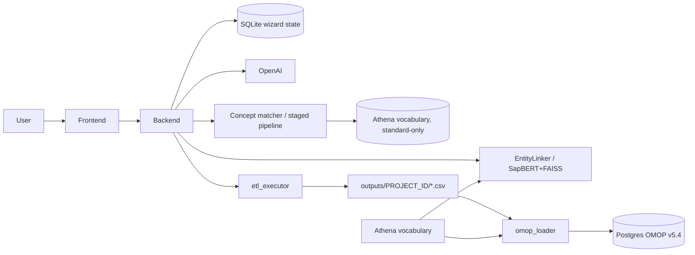

# OMOP ETL Auto-Designer

A code-less, browser-based ETL builder that converts any flat source CSV into an
OMOP CDM v5.4 compliant database. Users define all transformation logic through
a wizard UI (7 required steps + up to 4 optional OMOP table steps); OpenAI
generates the per-table Python transformations; a bundled Postgres container
with the full OMOP CDM v5.4 schema receives the loaded data.

---

## Architecture


```mermaid
flowchart LR
  User --> Frontend
  Frontend --> Backend
  Backend --> SQLite[(SQLite wizard state)]
  Backend --> OpenAI
  Backend --> EntityLinker[EntityLinker / SapBERT+FAISS]
  Backend --> ConceptMatcher[Concept matcher / staged pipeline]
  ConceptMatcher --> VocabDb[(Athena vocabulary, standard-only)]
  Backend --> Executor[etl_executor]
  Executor --> Outputs[outputs/PROJECT_ID/*.csv]
  Outputs --> Loader[omop_loader]
  Loader --> Postgres[(Postgres OMOP v5.4)]
  VocabBundle[Athena vocabulary] --> Loader
  VocabBundle --> EntityLinker
```

```
ETL_auto_designer/
├── backend/                FastAPI + SQLite (wizard state)
│   ├── app/
│   │   ├── api/            REST routes
│   │   ├── services/       etl_executor, omop_loader, vocab_loader, code_generator
│   │   ├── prompts/        Per-table prompt templates for OpenAI
│   │   └── ...
│   ├── omop_ddl/           OHDSI CDM v5.4 DDL + PKs (applied by omop-init)
│   ├── uploads/            Uploaded source CSVs / mapping CSVs
│   ├── outputs/            Generated OMOP CSVs per project
│   ├── Dockerfile
│   └── requirements.txt
│
├── frontend/               React + Vite + TailwindCSS (slug-based wizard)
│   ├── src/
│   │   ├── pages/wizard/   SourceStep … FinalizeStep
│   │   ├── components/     Shared UI (ConceptSearch, ErrorBanner, …)
│   │   ├── hooks/          useTableConfig
│   │   ├── api/client.ts   Axios client
│   │   └── types/
│   └── Dockerfile
│
├── entitylinker/           SapBERT + FAISS concept-search service
│   ├── entitylinker/       Python library (ConceptLinker, Reranker, config loader)
│   ├── api/                FastAPI app exposing POST /api/conceptlink
│   ├── config.container.yaml  data_dir + vocabularies for the container
│   ├── dockerfile
│   └── requirements.txt
│
├── scripts/init-omop.sh    Calls python -m app.services.ddl_applier bootstrap to split vocab/clinical DDL into separate schemas
├── docker-compose.yml      Postgres + omop-init + entitylinker + conceptmatcher + backend + frontend
└── .env.example            Stack-wide environment variables

../new concept finding/     Sibling checkout — the staged concept matcher (see below).
                            Built here as the `conceptmatcher` service; not vendored in.
```

---

## Quick start (Docker — recommended)

```powershell
# 1. Copy and edit env file (set OPENAI_API_KEY)
copy .env.example .env

# 2. Bring the whole stack up
docker compose up --build
```

Services:

| Service        | URL                       | Notes                                        |
|----------------|---------------------------|----------------------------------------------|
| Frontend       | http://localhost:5173     | Vite dev server                              |
| Backend        | http://localhost:8000     | FastAPI + Swagger at `/docs`                 |
| EntityLinker   | http://localhost:8001     | SapBERT + FAISS concept search. Swagger at `/docs`. Internal URL `http://entitylinker:8000/api/conceptlink`. |
| Postgres       | localhost:5432            | `psql -U omop -d omop`                       |
| `omop-init`    | one-shot                  | Splits the OMOP v5.4 DDL into vocabulary and clinical buckets and applies each into its own schema (`${OMOP_VOCAB_SCHEMA}` and `${OMOP_SCHEMA}`). Idempotent via per-schema marker rows. |

The DDL splitting and application is owned by `backend/app/services/ddl_applier.py`. The `omop-init` service is a thin shell wrapper that waits for Postgres and invokes `python -m app.services.ddl_applier bootstrap`. Clinical sessions run with `search_path = <clinical>, vocab, public` so unqualified `concept` lookups resolve.

---

## Quick start (local Python / Node)

```powershell
# Backend
cd backend
copy .env.example .env       # set OPENAI_API_KEY
pip install -r requirements.txt
python -m uvicorn app.main:app --reload --port 8000

# Frontend
cd frontend
npm install
npm run dev
```

The DB-load card in the Finalize step is only fully functional when Postgres is reachable; you can still configure and generate all scripts without it.

---

## Environment variables

Set in repo-root `.env` (consumed by `docker-compose.yml`) and/or `backend/.env`:

| Variable                | Default                                | Purpose                                                       |
|-------------------------|----------------------------------------|---------------------------------------------------------------|
| `OPENAI_API_KEY`        | *(required for codegen / chat)*        | OpenAI API key                                                |
| `OPENAI_MODEL`          | `gpt-4o`                               | Model used for code generation and the chat assistant         |
| `ENTITYLINKER_URL`      | (inside Docker: `http://entitylinker:8000/api/conceptlink`) | SapBERT+FAISS concept-search service. Started automatically by the compose stack. |
| `DATABASE_URL`          | `sqlite:///./etl_designer.db`          | Wizard state DB (kept on SQLite for simplicity)               |
| `POSTGRES_USER`         | `omop`                                 | OMOP Postgres user                                            |
| `POSTGRES_PASSWORD`     | `omop`                                 | OMOP Postgres password                                        |
| `POSTGRES_DB`           | `omop`                                 | OMOP Postgres database                                        |
| `OMOP_DB_HOST`          | `postgres`                             | Backend uses this to reach Postgres (set to `localhost` outside Docker) |
| `OMOP_DB_PORT`          | `5432`                                 |                                                               |
| `OMOP_SCHEMA`           | `cdm`                                  | Target schema for the clinical CDM tables                     |
| `OMOP_VOCAB_SCHEMA`     | `vocab`                                | Target schema for the shared vocabulary tables                |
| `ATHENA_BUNDLE_ROOT`    | *(empty)*                              | Allow-list root for `/load-vocabulary` (security guard)       |
| `MAPPINGS_BUNDLE_ROOT`  | *(empty → uploads dir)*                | Allow-list root for `/load-mappings-from-dir`                 |
| `CONCEPT_MATCHER_URL`   | (inside Docker: `http://conceptmatcher:8000`) | Bulk concept matcher behind the Concepts step's "Load concepts" button. Empty disables the button. |
| `CONCEPT_PIPELINE_PATH` | `../new concept finding`               | Docker build context for that service — the sibling checkout  |
| `CONCEPT_MATCHER_PORT`  | `8002`                                 | Host port the matcher is published on                         |
| `CONCEPT_MATCHER_EMBEDDINGS` | `1`                               | Build arg. `0` drops Stage 5 and shrinks the image ~2GB → ~310MB; the remaining stages' weights are renormalized rather than scored zero |
| `VOCAB_DB_HOST` / `VOCAB_DB_PORT` | `host.docker.internal` / `5433` | Where the matcher finds the standard-only Athena vocabulary   |
| `VOCAB_DB_NAME` / `VOCAB_DB_USER` / `VOCAB_DB_PASSWORD` | `athena_vocab` / `vocab` / `vocab_pwd` | Credentials for that vocabulary database  |

---

## Automatic concept matching (Concepts step → "Load concepts")

The Concepts step has two, quite different, concept finders:

| | **AI Search** (per row) | **Load concepts** (whole project) |
|---|---|---|
| service | `entitylinker` — SapBERT + FAISS | `conceptmatcher` — the staged pipeline in `../new concept finding` |
| answers | "what concepts look like this phrase?" — a ranked list you pick from | "what is this column?" — one concept per column, plus a decision |
| you get | candidates + optional GPT justification | `auto_accept` / `review` / `unmapped` per column, with a confidence |
| vocabulary | the Athena bundle at `ATHENA_BUNDLE_PATH` | that project's own Postgres: **standard + valid concepts only** |

### What the matcher actually is

It is not a second embedding search. It is a ten-stage pipeline over a
standard-only Athena vocabulary (3,518,557 concepts), one module per stage in
that project's `pipeline/`, driven by its `runner.py`:

| stage | what survives |
|---|---|
| 0 preprocess | identifier splitting, abbreviations, units, codes, dates, phrases, stopwords, lemmas → **1..N interpretations** of the input |
| 1 exact / code | manual mapping → code → exact name → exact synonym. **A hit exits at 100** |
| 2 full-text search | Postgres FTS, 4-rung query ladder, ≤30 candidates |
| 3 weighted Jaccard | IDF-weighted token-set overlap, ≤15 |
| 4 fuzzy | trigram / Levenshtein / acronym-by-initials, ≤10 |
| 5 embeddings | MiniLM cosine; re-scores, eliminates nothing |
| 6 composite | weighted score → `auto_accept` / `review` / `unmapped` |
| 7 validate + log | validation flags, mapping log, feedback store |
| 8 batch | thread pool + caches — **this is the path `/match` takes** |
| 9 report | reporting views |

Stages 2–5 run once per Stage 0 interpretation and stage 6 keeps the best score
per concept across all of them. Composite score is
`35% FTS + 25% Jaccard + 20% fuzzy + 20% embedding`, renormalized over whichever
stages actually produced a score — a stage that did not run is not counted as
zero. Then ≥ 90 auto-accepts, ≥ 70 goes to review, below that is unmapped after
one retry with the domain filter dropped.

Two consequences are worth carrying in your head while using the step:

- **A Stage 1 exact hit exits at 100 before Stage 6 ever runs**, so none of the
  composite scoring or its penalties apply to it. That is why Stage 1 carries
  its own hard filters rather than relying on later stages to correct it.
- **The lexical stages do most of the work.** Turning embeddings off costs
  nothing measurable on column-name matching (gold set: 92.0% without, 90.0%
  with) and saves ~40 ms/column. They are on as insurance for inputs where the
  lexical stages have little to grip.

Full documentation is that project's own [`README.md`](../new%20concept%20finding/README.md)
(~990 lines, including every measured dead end) and its
[`CLAUDE.md`](../new%20concept%20finding/CLAUDE.md) for the short version. Read
those before changing anything matcher-side; nothing about the stages is
configurable from this repo.

### Give it descriptions first

The matcher's accuracy hinges on what it is given. A column *name* is an
identifier — `DOC_PAT_HAIR`, `creat_mgdl` — while a description is prose a
vocabulary can actually be searched with, and the pipeline searches both. Same
project, `city` as the only input versus `city` + "City of residence": the
second is an exact hit on concept 4335813 at confidence 100; the first is a
guess.

So the **Descriptions** button next to *Load concepts* opens the project's data
dictionary:

- **Download template** — a CSV of every source column (`name,table,description`),
  pre-filled with whatever is already stored, so it doubles as an export.
- **Upload CSV / Excel** — merges a dictionary in (tick *Replace* to start over).
  Bring whatever you already have: `.csv`, `.tsv` or `.xlsx`; delimiter and
  encoding are sniffed; the header row can say `name`/`column`/`variable`/`field`
  and `description`/`definition`/`label`/`meaning`; column names match regardless
  of case, spaces or underscores; other columns are ignored. Rows naming a column
  the project doesn't have are reported back, not dropped silently.
- Each row also has an editable **Description** field, for fixing one entry
  without another round-trip through a spreadsheet.

Descriptions live on the project (`projects.column_descriptions`) and the backend
attaches them to every match request, so they apply no matter where the match is
triggered from.

### Running it

Every variable starts on **Map variable**, so one click on **Load concepts**
maps the whole project. It sends every included, still-unmapped column — across
*all* source files, not just the selected one. A variable that already has a
concept is never overwritten.

A variable switched to **Map values** (or **Map both**) is matched too, but by
its values rather than by its name — see the next section. The button's count is
the number of pieces of work queued, so a *Map both* variable counts twice.

What happens to each answer depends on how sure the pipeline was:

| its verdict | what the step does |
|---|---|
| **auto-accept** (≥ 90) | sets the concept, with a green confidence chip on the row |
| **review** (70–90) | **sets nothing.** The row offers the 5 ranked candidates, best first and marked *Best match*, for you to click |
| **unmapped** (< 70) | leaves the row untouched |

Two further outcomes are bucketed separately in the summary panel: **off-domain**
(a concept came back, but its domain is not one of the five domain tables this
wizard generates) and **failed** (the pipeline errored on that column).

The review case is the one that matters. A serum-creatinine column, for
instance, comes back at 82 with *Creatinine in peritoneal fluid/Creatinine in
serum* on top — while the concept you actually want, *Creatinine [Mass/volume]
in Serum or Plasma*, is fourth on the same shortlist, 2.7 points behind.
Writing the leader would have been quietly wrong; showing all five and letting
you pick takes one click and is right.

Rows awaiting a choice are badged while collapsed and have their own **Review**
filter in the toolbar, and the shortlists are saved with the rest of the step,
so a run survives a reload. The panel at the top lists, by name, what needs a
look and what came back unmapped.

### Variables mapped by value: two passes, one domain

A **Map values** variable has no single concept to find — each of its distinct
values is its own concept (`HTN` → *Hypertensive disorder*), and all of them have
to land in the **same** OMOP domain, because they all become rows of one
stem-table domain. Which domain that is, though, is only apparent once the values
have been looked up. So such a column is matched in two passes, per column:

1. **Pass 1** matches every distinct value with no domain restriction, and the
   domains that come back are counted. The most frequent one wins — among the
   five stem-table domains if any of them appear at all, since a concept outside
   them produces no usable row. A tie goes to whichever domain the column's first
   values pointed at.
2. **Pass 2** throws away every concept outside the winning domain and searches
   those values again with the matcher confined to it (the pipeline's `/match`
   takes a `domains` restriction per request). A value whose best overall match
   was off-domain therefore gets the best *in-domain* one instead of being
   dropped, and candidates outside the domain are stripped from the shortlists.

The per-value verdicts are then handled exactly like the per-column ones:
auto-accept sets the concept, review leaves the value's own 5-candidate shortlist
on its row, unmapped leaves it alone. A value you had already decided is never
touched. If the domain the values agreed on is *not* one of the five — nothing
stem-table-shaped can be built from it — nothing is set for that column at all,
and the summary says so. The summary panel reports the value totals and which domain each
variable's values were confined to, and the row badges how many of its values are
waiting on a choice.

Values are read server-side from the source CSVs (up to 500 distinct values per
column), so this works for columns of files other than the selected one. Columns
are sent one per request, which is what the per-column domain vote requires and
what lets the button report progress — a value run is much longer than a variable
run.

### What to expect from it

Measured on that project's two benchmarks — 50 lab/vitals columns graded by name
rule, and 206 real curated columns from a rheumatology study graded by
concept_id (only 117 of which are reachable at all, the rest being custom ids
≥ 2e9 or non-standard):

| | value |
|---|---|
| gold set, overall / literal / top-5 | 92.0% / 97.8% / 96.0% |
| gold set, accuracy within auto_accept | 100% |
| curated columns, exact concept_id (117) | 30.8% |
| curated columns, agreed on meaning | 60.7% (heuristic; over-counts by ~7) |
| curated columns, correct concept in top-5 | 58.1% |
| throughput | ~700 ms/column, 4 workers |

Read that as: **auto-accepts have been reliable, and the review queue is where
the real work is.** On a 32-column synthetic EHR schema the split was 18
auto-accept / 12 review / 2 unmapped, and both genuinely wrong answers were in
the review queue rather than accepted, each with the right concept visible in
its candidate list. That is the behaviour the step is built around.

Against EntityLinker on the same inputs, the two are near-opposites:

| | this pipeline | EntityLinker | + GPT |
|---|---|---|---|
| 114 curated columns, top-1 | **30.7%** | 9.6% | 14.9% |
| 114 curated columns, top-5 | **59.6%** | 18.4% | 18.4% |
| 50 lab columns, top-1 | 90.0% | **94.0%** | **96.0%** |
| ms/column | 384 | 136 | 5737 |

**Short canonical clinical terms → AI Search wins.** SapBERT is trained on
exactly that shape. **Questionnaire items, opaque variable names, prose →
Load concepts wins by ~3×**, because cosine on a 15-word survey item has nothing
to anchor on. EntityLinker returned the *instrument* ("Perceived stress
scale-10") for six individual PSS items. So the two buttons are complements, not
a fast path and a slow path — if a bulk run leaves a short lab column unmapped,
AI Search on that one row is the right follow-up.

### Three limits that will bite

**Source-vocabulary codes cannot resolve.** The matcher's vocabulary is
standard-and-valid only, which means **ICD10CM, ICD9CM, CPT4, ICD10 and ATC
have zero rows** in it — source vocabularies are non-standard by definition.
SNOMED, LOINC, RxNorm, NDC and HCPCS codes resolve normally. A column carrying
an ICD-10 code gets an explicit validation flag rather than a quiet fall-through
to a name match. Note this is a *different* vocabulary from the one Card 1 of
the Finalize step loads into Postgres, which is the unfiltered bundle.

**Variables versus values is the largest open defect.** OMOP holds both the
concept naming a variable and many concepts naming statements *about* it, and
the pipeline cannot reliably prefer the former: `height` returns
`4203099 Normal height` (Clinical Finding) rather than `3036277 Body height`;
"What is your profession?" returns `4076340 Employed` rather than
`36203487 Occupation [Type]`. Four separate attempts to fix this by penalising
extra words are recorded as measured failures in that project's README. This is
the main reason the review queue exists — skim it for this shape of error
specifically.

**The domain restriction exists in the pipeline but this wizard never sends
it.** `POST /match` accepts a `"domains"` allow-list, which costs no accuracy
and cuts ~38% of the latency when it is right, and it is the only tool that
touches the defect above (`--domain Measurement` puts `Body height` in the top
two). [`MatchConceptsPayload`](backend/app/api/concept_mapping.py#L262) has no
such field, so every run here is unrestricted. Worth adding if your project is
single-domain — a study's lab panel, one questionnaire.

### Bringing the matcher up

It needs the sibling project's **own** database — the standard-only Athena
vocabulary plus its `pipeline` schema, roughly 9GB — which is a separate stack
on host port 5433. That stack is not duplicated here; the container reaches the
running one through the host gateway, so the two stay independently startable.

```bash
cd "../new concept finding"
./load_vocab.sh          # the vocabulary (10-20 min, once)
./setup_pipeline.sh      # the pipeline's database objects (~2 min, once)

cd -                     # back here
docker compose up -d conceptmatcher
curl localhost:8002/health
```

The service is `pipeline/service.py` in that project, run as `serve`. The
`conceptmatcher` compose service and that project's own `pipeline` service share
one image tag (`vocab-pipeline:latest`), so whichever stack builds it first, the
other reuses it rather than building ~2GB of CPU torch twice.

Without all that, the button is disabled and says why — the step works exactly
as before, by hand.

### Keeping it current

That project's `pipeline/` and `data/` are bind-mounted read-only over the
image's own copies, the same way its own compose does it, so a changed
threshold, stopword list or scoring stage does **not** need a rebuild. What it
does need is a restart, because unlike the CLI — one-shot, so it re-reads
everything on each invocation — this is a long-running process that imported the
code once at startup:

```bash
docker compose restart conceptmatcher     # after editing the pipeline
docker compose build conceptmatcher       # only for requirements.txt changes
```

A stale matcher is otherwise invisible: it keeps answering, just with the old
ranking. `docker exec omop-conceptmatcher md5sum /app/pipeline/config.py`
against the host file settles it.

### Debugging a wrong answer

Nothing in this wizard explains *why* a column got the concept it got — the UI
shows a score and a shortlist, not the arithmetic. Take the question to the
sibling project's CLI, which prints the full per-stage breakdown:

```bash
cd "../new concept finding"
./pipeline.sh match --name creat_mgdl --description "Serum creatinine mg/dL" --explain
```

`--explain` first: most wrong answers are one stage overpowering the others
rather than a missing feature, and it shows which stage chose the winner.
`./pipeline.sh shell` is the same thing interactively, with the embedding model
loaded once (~250 ms/query instead of a ~10 s model load per invocation).

Tuning lives entirely in that project, not here:

| what | where |
|---|---|
| thresholds, weights, feature flags | `data/pipeline.json` (copy its `pipeline.example.json`); `PIPELINE_CONFIG` already points the container at it |
| abbreviations, units, phrases, stopwords, equivalents | `pipeline/resources/*_local.*` — merged over the shipped defaults, so they survive updates |
| a human correction, remembered | `./pipeline.sh feedback --column … --concept … --source-system <project id>` — Stage 1 short-circuits to it from then on |

Both of the first two take effect on `docker compose restart conceptmatcher`,
no rebuild. The feedback store is scoped by `source_system`, and this backend
sends the **project id** as that value, so a correction recorded for one project
never leaks into another's.

---

## Wizard walkthrough

Steps 2–4 and Death are optional (toggled from the Source step's table picker). All others are required.

| Step (slug)       | Page                       | Purpose                                                                                                                          |
|-------------------|----------------------------|----------------------------------------------------------------------------------------------------------------------------------|
| `source`          | Source upload              | Drop in your flat CSV — delimiter, encoding and columns are auto-detected. Toggle optional OMOP tables here.                     |
| `location` *      | Location                   | Map address columns (city, state, county/country) for both person and care site, with separate country-concept mappings.         |
| `care-site` *     | Care Site                  | Configure care_site name + place_of_service. Warns if Location has no `cs_*` columns mapped.                                    |
| `provider` *      | Provider                   | Provider source value, gender default, specialty mapping (prefix or value-map). Help text clarifies precedence.                  |
| `person`          | Person                     | Person ID, gender, DOB strategy (full date vs year-only), race/ethnicity. Shows the FK columns inherited from earlier steps.     |
| `visit`           | Visit                      | Define multiple visit timepoints. Each gets a stable internal id; `visit_source_value` is auto-computed as `{person}|{label}`.   |
| `obs-period`      | Observation period         | Start date is required; period-type uses a dropdown of standard OMOP concepts.                                                   |
| `death` *         | Death                      | Inline help clarifies filter semantics (empty filter → all rows treated as deceased).                                            |
| `concepts`        | Concept mapping            | Per-column decision, defaulting to **Map variable**. Upload a data dictionary under **Descriptions**, then **Load concepts** maps every variable at once through the staged matcher — and every distinct value of the **Map values** variables, two passes so all of a variable's values share one domain (see above); AI Search and manual entry handle the rest. Gate-on-progress before next. |
| `stem-table`      | Stem table                 | Variable groups derived from the visit labels defined in the Visit step. Structural FK columns hidden from the picker.           |
| `finalize`        | Generate + Load            | Generate all scripts (or per-table), execute them in dependency order with per-table logs, then load results into Postgres. Two cards: **Card 1** bulk-loads the Athena vocab bundle; **Card 2** bulk-COPYs the project's output CSVs and optionally applies indices + FK constraints. |

\* optional — only shown when enabled from the Source step.

---

## Execution model

`etl_executor.execute_etl_scripts` runs **one Python subprocess per generated table**, in the dependency order
`location → care_site → provider → person → visit_occurrence → observation_period → stem_table → death`,
sharing `ETL_OUTPUT_DIR` so each script can read its predecessors' output. The per-table status, log
fragment, row count and elapsed time are returned to the UI and surfaced on the Finalize step.

---

## OMOP CDM v5.4 DDL

`backend/omop_ddl/` ships with the OHDSI Postgres DDL + primary keys vendored from
[CommonDataModel v5.4](https://github.com/OHDSI/CommonDataModel/tree/v5.4/inst/ddl/5.4/postgresql).
The vendored DDL file intermingles vocab and clinical `CREATE TABLE` statements;
[`backend/app/services/ddl_applier.py`](backend/app/services/ddl_applier.py) parses it at import
time, buckets statements by table name (`VOCAB_TABLES` list), and applies each bucket into a
separate schema:

- Vocabulary tables (concept, vocabulary, …) → `${OMOP_VOCAB_SCHEMA}` (default `vocab`)
- Clinical tables (person, visit_occurrence, …) → `${OMOP_SCHEMA}` (default `cdm`) or a
  project-scoped schema picked in the Finalize step.

Per-schema `__ddl_marker` rows make application idempotent. Indices and FK constraints are
**not** applied by `omop-init`; they're triggered from the Finalize step when the user ticks
"Apply indices and FK constraints after load".

---

## Loading OMOP outputs into Postgres (Finalize step)

The Finalize step is split into two cards.

**Card 1 — Vocabulary** calls `POST /api/load-vocabulary` after auto-detecting an Athena
bundle at `/vocab` (overridable via free-text). The backend ensures the `vocab` schema and
its DDL exist, then `vocab_loader.py` truncates and bulk-loads each `<TABLE>.csv` with
`COPY ... WITH (FORMAT csv, DELIMITER E'\t', HEADER, QUOTE E'\b')`. Per-file progress is
polled via `GET /api/vocab-status`.

**Card 2 — ETL** calls `POST /api/projects/<id>/load-database` with the chosen
`schema_mode`, optional `schema_name`, `truncate`, and `apply_indices` flag. The backend
ensures the clinical schema and DDL exist (idempotent), sets `search_path = <clinical>, vocab, public`
on the load connection, then `omop_loader.py` walks each generated CSV, intersects its
columns with the target table's columns from `information_schema.columns`, and bulk-loads
the intersection with `COPY ... WITH (FORMAT csv, DELIMITER ';', NULL '', QUOTE '"')`. When
`apply_indices` is true, two synthetic table rows (`__indices__`, `__constraints__`) appear
in the per-table progress and are filled by `ddl_applier.apply_indices` / `apply_constraints`
after the CSV load. Per-table status is polled via `GET /api/projects/<id>/load-status`.

Both polls run at 1.5 s.

---

## Vocabulary files — single source of truth

You only manage **one** directory on the host. Point `ATHENA_BUNDLE_PATH` (in `.env`) at the
folder containing your unzipped Athena export, and three different components pick what they
need from it:

| Component | Files read | Mounted at | Mode |
|---|---|---|---|
| Finalize / Card 1 — vocab loader | CONCEPT.csv, VOCABULARY.csv, DOMAIN.csv, CONCEPT_CLASS.csv, RELATIONSHIP.csv, CONCEPT_RELATIONSHIP.csv, CONCEPT_SYNONYM.csv, CONCEPT_ANCESTOR.csv, DRUG_STRENGTH.csv (all tab-delimited) | `/vocab` on `backend` | read-only |
| Finalize / Card 2 — ETL loader | (your project's generated CSVs in `outputs/<project_id>/`) | `/app/outputs` on `backend` | read-write |
| Concepts step — EntityLinker concept search | CONCEPT.csv (tab-delimited) only | `/data` on `entitylinker` | read-write* |

*EntityLinker uses the same directory to cache its FAISS index and SapBERT embeddings
(`embeddings_*.npy`, `lookup_*.csv`, `faiss_*.index`). These files are auto-created on first
run (a few minutes for SNOMED+LOINC; longer for full RxNorm). `.gitignore` already excludes
them.

**Concretely**: drop your unzipped Athena bundle anywhere on the host, set
`ATHENA_BUNDLE_PATH=/your/absolute/path` in `.env`, then `docker compose up --build`.
Card 1 of the Finalize step auto-detects the bundle and shows "Detected 9 vocabulary files"; the
EntityLinker container starts building its FAISS index on first request.

If you don't want to bundle EntityLinker's caches with the same dir, mount them separately
by editing `docker-compose.yml` — change the `entitylinker` service's
`${ATHENA_BUNDLE_PATH:-./vocab_bundle}:/data` to a dedicated cache volume and copy
`CONCEPT.csv` into it.

## Upgrading from a pre-vocab-schema dev DB

Earlier versions stored vocabulary tables in the same schema as clinical data (`cdm`). To
upgrade, the simplest path is to drop the Postgres volume:

```powershell
docker compose down -v   # removes pgdata
docker compose up --build
```

`omop-init` will create both `vocab` and `cdm` cleanly. If you want to preserve any other
schemas in the database, run instead:

```powershell
docker compose exec postgres psql -U omop -d omop -c "DROP SCHEMA cdm CASCADE; DROP SCHEMA IF EXISTS vocab CASCADE;"
docker compose restart omop-init
```

Per-project `cdm_<id>` schemas are unaffected.

---

## API reference (selected)

| Method | Endpoint                                          | Description                                               |
|--------|---------------------------------------------------|-----------------------------------------------------------|
| POST   | `/api/projects/`                                  | Create a project                                          |
| POST   | `/api/projects/{id}/upload-source`                | Upload + auto-detect source CSV                           |
| POST   | `/api/projects/{id}/upload-mapping`               | Upload one concept-mapping CSV                            |
| POST   | `/api/projects/{id}/load-mappings-from-dir`       | Bulk load mapping CSVs from a directory (allow-listed)    |
| PATCH  | `/api/projects/{id}/config`                       | Save a wizard step's config                               |
| POST   | `/api/projects/{id}/generate`                     | Generate ETL scripts (all tables)                         |
| POST   | `/api/projects/{id}/generate/{table}`             | Generate one table                                        |
| POST   | `/api/projects/{id}/execute`                      | Execute the generated ETL                                 |
| GET    | `/api/projects/{id}/execution-log`                | Last execution status                                     |
| POST   | `/api/projects/{id}/load-database`                | Bulk-load output CSVs into Postgres (accepts `apply_indices: bool`) |
| GET    | `/api/projects/{id}/load-status`                  | Live ETL load progress                                    |
| POST   | `/api/load-vocabulary`                            | Load an Athena bundle into the configured vocab schema    |
| GET    | `/api/vocab-status`                               | Live vocabulary load progress                             |
| GET    | `/api/vocab-bundle-info?path=/vocab`              | Auto-detect vocab CSVs at a path (path must lie inside `ATHENA_BUNDLE_ROOT`) |
| GET    | `/api/db-health`                                  | Postgres reachability + per-schema DDL + vocab row count  |
| POST   | `/api/projects/{id}/chat`                         | AI assistant for a specific table's generated code        |
| GET    | `/api/projects/concept-matcher/health`            | Is the bulk concept matcher up, and what has it loaded    |
| POST   | `/api/projects/{id}/match-concepts`               | Map a column list onto standard OMOP concepts in one pass |
| POST   | `/api/projects/{id}/match-values`                 | Map a column's distinct values, two passes, one domain per column |
| GET/PUT| `/api/projects/{id}/column-descriptions`          | Read / replace the project's data dictionary              |
| POST   | `/api/projects/{id}/column-descriptions/upload`   | Merge in a CSV/Excel dictionary (`?replace=true` to overwrite) |
| GET    | `/api/projects/{id}/column-descriptions/template` | Pre-filled `name,table,description` CSV to fill in        |

---

## Smoke test

Run an end-to-end check against the bundled test source:

```powershell
./scripts/smoke.ps1
```

The script creates a project, uploads `test_data/test_source.csv`, generates scripts,
executes them, and prints the resulting output file list and per-table row counts.
