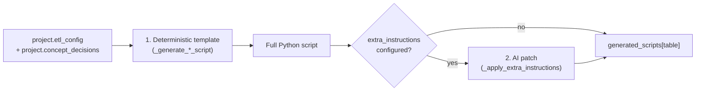

# ETL script generation

How the backend turns wizard config into runnable Python ETL scripts. Everything
described here lives in [`backend/app/services/code_generator.py`](../backend/app/services/code_generator.py)
and is invoked from [`backend/app/api/codegen.py`](../backend/app/api/codegen.py).

---

## Two-phase generation, per table

Every OMOP table is generated in up to two phases:



1. **Deterministic template** — a `_generate_<table>_script(project)` function builds
   the complete script as an f-string/concatenation, purely from `project.etl_config`
   and `project.concept_decisions`. No LLM call. Every table has one of these.
2. **AI patch (optional)** — only runs if the table has non-empty "Extra instructions"
   text. The deterministic script is handed to the model along with the instructions,
   and the model's edits are merged back in. See [AI patch pass](#ai-patch-pass) below.

This is orchestrated by `generate_table_script(project, table)`
([code_generator.py:5393](../backend/app/services/code_generator.py#L5393)), which every
API route funnels through — both single-table (`POST /generate/{table}`) and bulk
(`POST /generate`) generation.

**Regeneration is always from scratch.** Step 1 always re-runs, even if the table was
previously AI-patched — the previously saved `generated_scripts[table]` is never read
back in as a starting point. So editing generated code by hand and then clicking
"Generate" again on that table discards the hand edit; only the deterministic template
+ current extra-instructions text survive.

| Table                  | Generator function                    |
|-------------------------|----------------------------------------|
| `location`              | `_generate_location_script`            |
| `care_site`              | `_generate_care_site_script`           |
| `provider`               | `_generate_provider_script`            |
| `person`                 | `_generate_person_script`              |
| `visit_occurrence`       | `_generate_visit_occurrence_script`    |
| `observation_period`     | `_generate_observation_period_script`  |
| `stem_table`             | `_generate_stem_table_script`          |
| `death`                  | `_generate_death_script`               |
| `measurement`, `observation`, `drug_exposure`, `procedure_occurrence`, `condition_occurrence` | `_generate_domain_script` (one shared template, parameterized by `domain_id`) |

---

## stem_table — the deterministic template

`_generate_stem_table_script(project)` ([code_generator.py:3993](../backend/app/services/code_generator.py#L3993))
is the largest and most config-driven generator — routinely 500–900+ generated lines,
because it folds together every domain's field logic (unit, route, modifier, condition
status, qualifier, operator, drug-exposure sibling columns, measurement reference
ranges) into one per-variable pass.

Inputs pulled from the project:

- `project.etl_config["stem_table"]`, `["visit_occurrence"]`, `["person"]` — wizard config
- `project.concept_decisions` — per-variable strategy/mapping decisions from the Concepts step
- `project.source_files` — one or more uploaded source CSVs, each with its own mapped columns

What it builds, before emitting any code:

- **Per-source-file variable lists** — each source file only processes the columns
  mapped to variables that actually live in it, so multi-file projects don't
  cross-reference columns from another file.
- **Fixed-value maps** for unit / route / modifier / condition status / qualifier /
  operator — used when the Concepts step configured a single fixed concept for a
  variable instead of a per-row lookup column (nothing to look up in that case, so the
  value is baked in directly).
- **`SPECIAL_OVERRIDES`** — background-inferred overrides from `_infer_stem_overrides`
  (e.g. a fixed unit with no unit column) merged with user-entered overrides from the
  Stem Table step UI. Inferred entries come first; user entries win on conflict (dict
  overwrite, later entry wins).

The emitted script's `main()`, per row, per mapped variable:

1. **Resolves the visit** — one of three mutually exclusive modes:
   - an explicit `visit_source_col` value on the row,
   - auto-numbered visits (`visit1`, `visit2`, … per person),
   - or a substring match against `VARIABLE_VISIT_MAP` (configured per-variable in the
     Stem Table step).

   The visit label becomes `visit_record_source_value = f'{person_source_value}-{label}'`,
   looked up via `lookup_visit_occurrence_id()` against the already-generated
   `visit_occurrence.csv`. A miss drops the row and warns **once per distinct missing
   visit** (not once per row/variable — one absent visit is usually referenced by every
   variable mapped to it, so per-row warnings would be pure noise).
2. **Resolves the concept and value** via `lookup_concept()`, backed by
   `variable_mapping.csv` / `value_mapping.csv` / `variable_value_mapping.csv`.
3. **Resolves domain-specific sibling fields** — unit, route, modifier, condition
   status, qualifier, operator, drug-exposure fields (quantity, days supply, refills,
   sig, lot number, stop reason), measurement reference range. Each of these is a
   harmless no-op for variables/domains that don't use it.
4. **Applies `SPECIAL_OVERRIDES`** for the variable, if any.
5. **Appends the row** via a generated `_append_row(**overrides)` helper, called at a
   fixed marker:

   ```python
   # <<< AI-PATCH INSERTION POINT >>>
   # Per-variable custom logic (Extra Instructions) is inserted here,
   # after every field above has its final value, and calls
   # _append_row(field=value, ...) — never inline rows.append({...}).
   _append_row()
   ```

   That marker is the seam the AI patch phase targets.

---

## AI patch pass

`_apply_extra_instructions(code, instructions, table, project_id)`
([code_generator.py:5281](../backend/app/services/code_generator.py#L5281)) sends the
deterministic script plus the user's instructions to OpenAI and merges the result back
in. The instructions come from two places, concatenated by `_stem_variable_instructions`
for stem_table specifically:

- the table's own `extra_instructions` field (set in that table's wizard step), and
- for stem_table only, every per-variable `extra_instructions` set in the Concepts step
  (`- For variable "X": ...`).

**Two different protocols, by table:**

| | Other tables | `stem_table` |
|---|---|---|
| Script size | Small enough to retype cheaply | Often 500–900+ lines — retyping the whole file risks the completion-token ceiling and looks stalled |
| Model returns | The complete rewritten script | `<<<<<<< SEARCH / ======= / >>>>>>> REPLACE` diff blocks — only the changed lines |
| Applied by | Used directly (`_strip_fences`) | `_apply_search_replace_blocks(code, diff_text)` ([code_generator.py:5181](../backend/app/services/code_generator.py#L5181)) |

For the diff protocol, each `SEARCH` block must match the current code **exactly once**
at the time it's applied (blocks are applied in order, so a later block can target text
a prior block just introduced). If a block doesn't match, or matches more than once, the
whole patch is rejected with an error naming the offending block — nothing is applied
partially.

The model doesn't always follow the diff format, so there are two accepted fallbacks
before giving up:

1. **Full rewrite anyway** — if the response has no diff blocks but is valid Python
   containing the same `def main():` / `if __name__ ==` entry point as the original,
   it's accepted as a complete replacement rather than discarded.
2. **Bare insertion fragment** — with many per-variable instructions all targeting the
   single shared `# <<< AI-PATCH INSERTION POINT >>>` marker, the model sometimes drops
   the SEARCH/REPLACE wrapper but still retypes only that one fragment (from the marker
   comment down to the trailing `_append_row()` call). If the marker is unique in the
   script and the fragment's first/last lines match, it's spliced in directly — but only
   if doing so still produces syntactically valid Python.

If none of these apply, generation fails with a message asking the user to rephrase the
instructions.

**Streaming + progress.** The completion is streamed, and each chunk updates an
in-memory progress entry keyed by `(project_id, table)` via `_set_generation_progress`.
The frontend polls `GET /projects/{id}/generate/{table}/progress` to show a live token
counter while generation is in flight; the entry is cleared when the call finishes
(`_clear_generation_progress`, in a `finally` block, so it's cleared on error too).

If the completion hits the token ceiling (`finish_reason == "length"`), generation fails
outright rather than returning a truncated script — the user is asked to shorten or
split the instructions.

---

## Domain routing tables

`_generate_domain_script(table)` ([code_generator.py:4855](../backend/app/services/code_generator.py#L4855))
is purely deterministic: it reads `stem_table.csv` and writes out the rows matching one
`domain_id` (`measurement`=1, `observation`=2, `drug_exposure`=3,
`procedure_occurrence`=4, `condition_occurrence`=5). Same template for all five,
parameterized by the target domain.

The UI only exposes a "Generate" action for `stem_table` itself — the five domain
tables aren't separate wizard buttons. So `POST /projects/{id}/generate/stem_table`
special-cases stem_table to also (re)generate all five domain scripts immediately after
([codegen.py:76-83](../backend/app/api/codegen.py#L76-L83)); without this they'd never
enter `generated_scripts` and the Execute step would silently skip them, producing no
`measurement.csv`, `observation.csv`, etc. The same bundling happens in
`generate_all_table_scripts` for the "generate everything" path.

---

## Execution order

Generated scripts are later run by `etl_executor.execute_etl_scripts` (see the root
[README](../README.md#execution-model)), one subprocess per table, in dependency order:
`location → care_site → provider → person → visit_occurrence → observation_period →
stem_table → death`, plus the domain tables after `stem_table`. Each script reads its
predecessors' CSVs from the shared `ETL_OUTPUT_DIR`.
